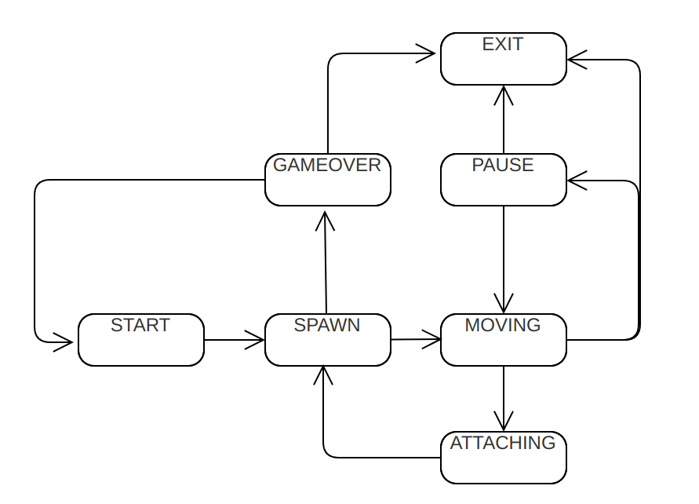

## BrickGame Tetris

BrickGame v1.0 is a console-based Tetris game developed in C using the ncurses library. It features a classic Tetris gameplay experience with additional mechanics such as score counting, level progression, and high score tracking.

## Game control

* Classic Tetris gameplay with the following mechanics:
    - Rotation of tetrominoes
    - Horizontal movement of tetrominoes
    - Accelerated tetromino falling (by holding the down arrow key)
    - Display of the next tetromino
    - Line clearing
    - Game over when the tetromino reaches the top of the game field
* Support for all physical buttons on the console:
    - Start game - Enter
    - Pause - P
    - End game - Esc
    - Left arrow - move tetromino left
    - Right arrow - move tetromino right
    - Down arrow - accelerate tetromino falling
    - Up arrow - rotate tetromino

## Bonus mechanics

* Score Calculation
    - 1 line cleared: 100 points
    - 2 lines cleared: 300 points
    - 3 lines cleared: 700 points
    - 4 lines cleared: 1500 points

* High Score Tracking
    - Display of the player's current score and highest score achieved
    - Highest score is stored in a file or embedded database and persists between game sessions

* Level Progression
    - Progression of levels every 600 points
    - Increasing level increases the speed of tetromino falling

## Installation

1) do `git clone` repository.
2) navigame to `src/` directory.
3) run `make install` to install project.
4) run `make run` to start play.

## Finite State Machine (FSM) Diagram

